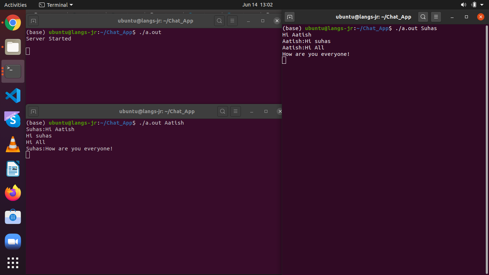

# Chat_App_using_TCP-IP

## How to Run:

  1) Start server: gcc server.c -pthread
                   ./a.out
                   
  2) start client: gcc client.c -pthread
                   ./a.out client_name
     
     Note: To create multiple clients use multile client_name
     
## Ouptut

